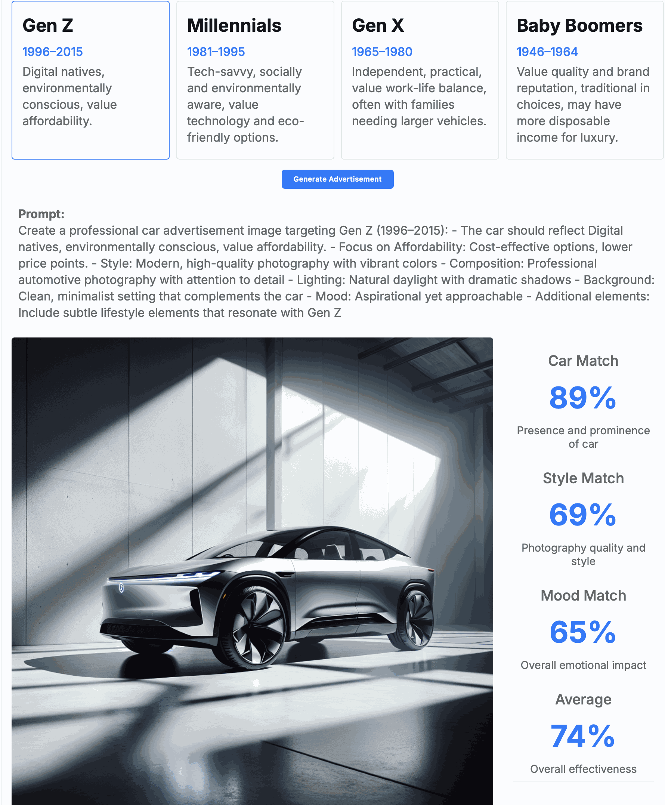

# AI Car Advertisement Generator

An intelligent system that generates and evaluates car advertisements using AI, with a focus on demographic targeting.



## Features

### 1. Agent System
- **Profile-Based Generation**: Creates targeted car advertisements for different demographics (Gen Z, Millennials, Gen X, Baby Boomers)
- **Narrative Integration**: Incorporates specific narratives (e.g., Sustainability, Innovative Tech) into the generation process
- **LangGraph Workflow**: Implements an agent workflow using LangGraph for:
  - Initial prompt generation
  - Image generation
  - Evaluation

### 2. Evaluation System
The system uses CLIP (Contrastive Language-Image Pre-training) to evaluate generated images across multiple dimensions:

- **Car Match**: Evaluates the presence and prominence of the car in the image
- **Style Match**: Assesses the quality of photography and visual style
- **Mood Match**: Measures the emotional impact and appeal
- **Overall Score**: Calculates the average effectiveness across all metrics

Each metric is normalized to a 0-100% scale for easy interpretation.

## Technical Stack

- **Frontend**: Flask web application with modern UI
- **Image Generation**: OpenAI's DALL-E 3
- **Evaluation**: CLIP model for image-text alignment
- **Agent Framework**: LangGraph for workflow management
- **Data Models**: Structured profiles and narratives for demographic targeting

## Setup

1. Clone the repository
2. Create a virtual environment:
   ```bash
   python -m venv venv
   source venv/bin/activate  # On Windows: venv\Scripts\activate
   ```
3. Install dependencies:
   ```bash
   pip install -r requirements.txt
   ```
4. Set up environment variables:
   ```bash
   cp .env.example .env
   # Edit .env with your OpenAI API key
   ```

## Usage

1. Start the web application:
   ```bash
   python app.py
   ```
2. Open your browser to `http://localhost:5002`
3. Select a demographic profile
4. Generate and evaluate car advertisements

## Project Structure

```
/
├── data_models/        # Data structures and classes
│   ├── profiles.py     # Demographic profiles
│   └── narratives.py   # Marketing narratives
├── agent/             # Agent-related code
│   ├── agent_nodes.py  # Agent workflow nodes
│   └── agent_states.py # Agent state management
├── utils/             # Utility functions
│   └── generate_prompt.py
├── templates/         # Web interface templates
├── app.py            # Flask application
└── main.py           # Command-line interface
```

## Evaluation Metrics

The system evaluates generated images using CLIP across three key dimensions:

1. **Car Match (0-100%)**
   - Evaluates how well the car is represented
   - Focuses on prominence and clarity

2. **Style Match (0-100%)**
   - Assesses photography quality
   - Evaluates visual style and composition

3. **Mood Match (0-100%)**
   - Measures emotional impact
   - Evaluates demographic appeal

## License

MIT License 